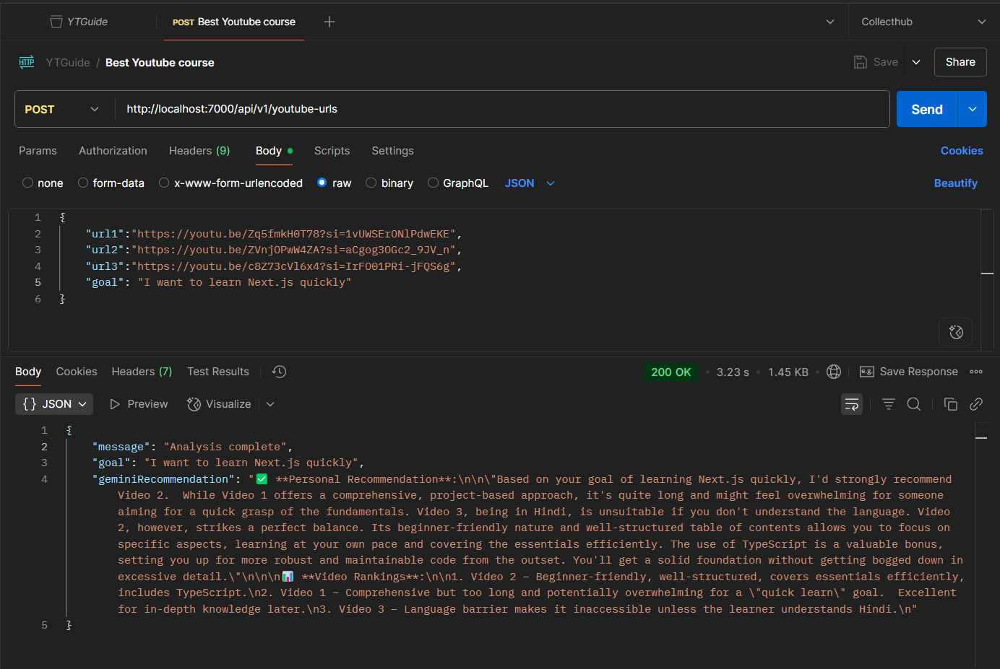
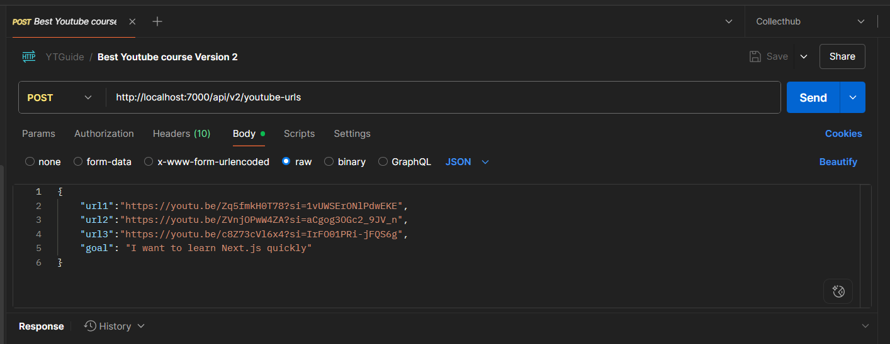
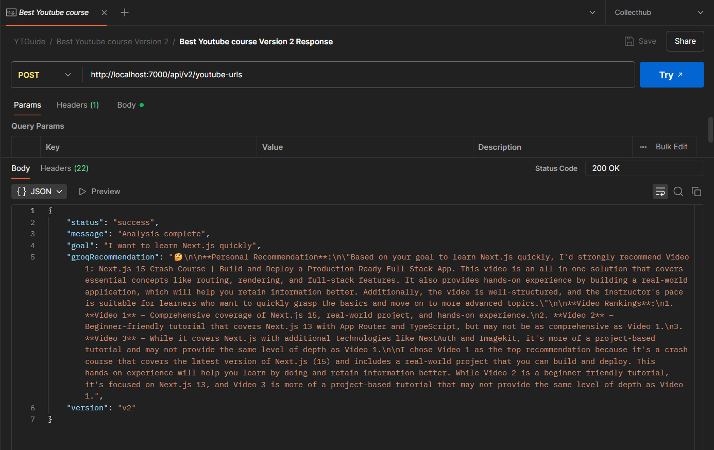
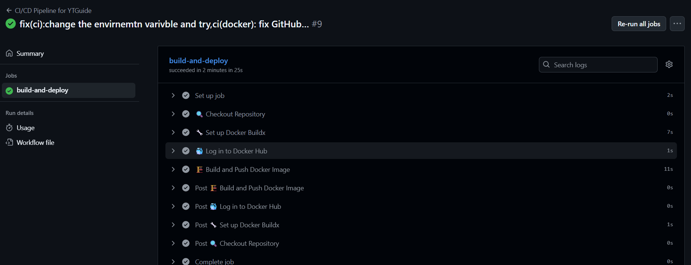

# 🎓 YTGuide

**Helping self-learners make smarter YouTube choices**

[Live Site 🚀](https://ytguide.onrender.com/)

---

## ✨ What is YTGuide?

**YTGuide** is an AI-powered SaaS platform that helps **self-learners evaluate and choose** the best YouTube course for any topic.

Users paste 2 or more YouTube links (videos or playlists), and YTGuide compares them using:

- ✅ Content analysis
- ✅ Relevance to goal
- ✅ Recency & clarity
- ✅ Overall learning value

It then **ranks and recommends** the best course to start with — saving learners hours of research.

---

## 🎯 Purpose

YTGuide is designed to:

- ❌ Eliminate low-quality or outdated tutorials  
- ✅ Provide **clear AI-backed reasoning** for rankings  
- 🧠 Act as your **personal course advisor** for YouTube  

---

## 📸 Screenshots

| 🔹 Home & Health Routes                | 🔹 API v1 & v2 Analysis Endpoints   |
|--------------------------------------|------------------------------------|
|  <br>  |  <br>  |

| 🔹 API v1 Request/Response            | 🔹 API v2 Request/Response          |
|--------------------------------------|------------------------------------|
|  <br>  |  |

---

## 🌐 Live URL

🔗 **[Visit YTGuide](https://ytguide.onrender.com/)**

---
## 🚀 Getting Started -- Dev 👨🏻‍💻 Guide

### ✅ Prerequisites

- [Node.js](https://nodejs.org/) (v14 or higher)
- YouTube Data API Key
- Gemini API Key
- Groq API Key

---

### 🛠️ Installation

1. **Clone the repository**

```bash
git clone https://github.com/kashyapprajapat/ytguide-backend.git
cd ytguide-backend
```

2. **Install dependencies**

```bash
npm install
```

3. **Environment Setup**

```bash
cp .env.sample .env
```

Update `.env` with your keys:

```env
YOUTUBE_API_KEY=your_youtube_api_key
GEMINI_API_KEY=your_gemini_api_key
GROQ_API_KEY=your_groq_api_key
PORT=3000
```

4. **Run the application**

```bash
npm start
```

---

### 📬 Test the API

- Health Check: `GET http://localhost:3000/health`
- v1 Endpoint: `POST http://localhost:3000/api/v1/youtube-urls`
- v2 Endpoint: `POST http://localhost:3000/api/v2/youtube-urls`

---

## 🏗️ Project Structure

```
YTGuide_Backend/
├── 📁 .github/          # GitHub workflows
├── 📁 DemoImage/        # Screenshots and demo images
├── 📁 helpers/          # Utility functions
│   ├── geminiHelper.js    # Gemini AI integration
│   ├── groqHelper.js      # Groq AI integration
│   └── youtubeHelper.js   # YouTube API functions
├── index.js            # Main application file
├── package.json        # Project dependencies
├── Dockerfile          # Docker container setup
└── README.md           # Project documentation
```

---

## 🔄 CI/CD Pipeline



**Automated Deployment Includes:**

- ✅ GitHub Actions Integration  
- ✅ Docker Containerization  
- ✅ Auto-Deploy to Render  
- ✅ `.env` Environment Management  
- ✅ Health Checks & Monitoring  

---

## 🎯 How It Works

> A breakdown of YTGuide's recommendation system

1. **Input:** User submits 3 YouTube video URLs + learning goal  
2. **Analysis:** AI fetches video metadata & descriptions  
3. **Processing:** Advanced models analyze quality, clarity, and alignment with the goal  
4. **Recommendation:** Personalized ranking with reasoning, pros, and cons  
5. **Output:** Best video to start learning with a clear explanation  

---

## 🤝 Contributing

Contributions are welcome! Here's how to get started:

```bash
# 1. Fork the repository
# 2. Create your feature branch
git checkout -b feature/AmazingFeature

# 3. Commit your changes
git commit -m 'Add some AmazingFeature'

# 4. Push to the branch
git push origin feature/AmazingFeature

# 5. Open a Pull Request
```
---

## 🙌 Acknowledgements
Developed with ❤️ by Kashyap ☕🧋👨🏻‍💻
